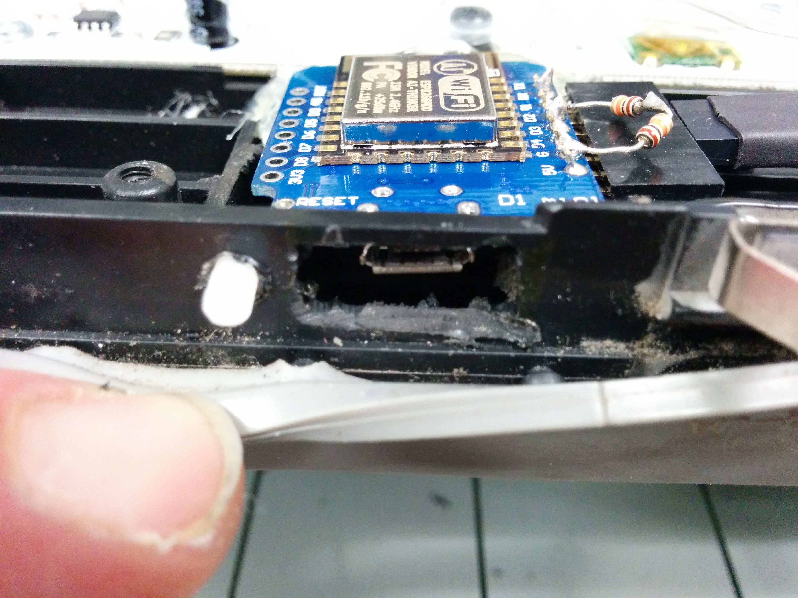

# wifingroomba

How to add wifi connection to i-robot Roomba (tested on Roomba-500).

Adaptation cost is less than $4: 
 - ESP8266: arduino/wifi module: $3
 - DSN-MINI-360: PSU module: https://www.aliexpress.com/store/product/Free-shipping-20pcs-lot-Mini-360-HM-Buck-Power-Module-2A-DC-DC-car-power-supply/1266255_1877349317.html $0.40
 - 1n4001 $0.1
 - 3 x 10k/0.125W resistors: $0.0
 - 5 x dupont cable (10cm)

Required tools:
 - Hot Glue Gun
 - Dremel with cutting disk
 - Lime

Important documentation:
 - Roomba specification document: http://www.irobot.lv/uploaded_files/File/iRobot_Roomba_500_Open_Interface_Spec.pdf

Hardware integration inside i-robot Roomba:
 - All modifications have been made with the main objective of maintaining the outer appearance of the robot as original as possible but facilitating interaction with the new hardware.
 - Disposition of the hardware inside the vacuum cleaner.
 
 - Detail of new usb port to connect with ESP8266.
 
 - Detail of ESP8266 with usb cable connected and stick to push reset button on ESP8266 board. 
 

